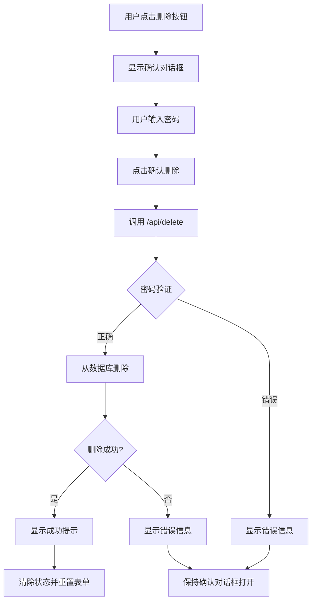

# 本地测试删除功能 - 实施总结

## 📍 当前状态

### 分支信息
- **分支名称**: `feature-delete-secret-local-test`
- **基于分支**: `main-chinese` (已修复滚动问题)
- **提交记录**: 
  - `41a8d9f` - Add: Delete secret feature for local testing only
  - `1d9977a` - Fix: Enable scrolling for Chinese version (从 main-chinese 合并)

### 文件变更

#### 新增文件
1. **app/api/delete/route.ts** (95 行)
   - 删除秘密的 API 端点
   - 密码验证机制
   - 数据库删除操作

2. **DELETE-FEATURE-TEST-GUIDE.md** (180+ 行)
   - 完整的使用指南
   - 测试场景说明
   - 安全机制文档

3. **LOCAL-TEST-DELETE-FEATURE-SUMMARY.md** (本文档)
   - 实施总结

#### 修改文件
1. **app/s/[id]/page.tsx** (+100 行)
   - 添加删除按钮
   - 添加确认对话框
   - 添加删除状态管理
   - 添加错误处理

## 🔧 功能实现

### 1. API 端点 (`/api/delete`)

#### 请求格式
```typescript
POST /api/delete
Content-Type: application/json

{
  "id": "SC-ABC123",
  "password": "user_password"
}
```

#### 响应格式
- **成功**: `{ "ok": true, "message": "秘密已删除" }`
- **失败**: `{ "error": "错误信息", "code": "错误代码" }`

#### 安全机制
1. **密码验证**: 通过尝试解密来验证密码正确性
2. **输入验证**: 检查 ID 格式和密码长度
3. **存在性检查**: 验证秘密是否存在于数据库中
4. **错误处理**: 详细的错误代码和消息

### 2. UI 组件

#### 删除按钮
- **位置**: 解密内容下方
- **样式**: 橙色背景 (#ff5722)，白色文字
- **图标**: 🗑️
- **行为**: 点击后显示确认对话框

#### 确认对话框
- **背景色**: 浅橙色 (#fff3e0)
- **内容**:
  - 警告信息："⚠️ 确认删除？"
  - 说明："此操作不可恢复！请输入密码确认删除。"
  - 错误提示区域（如果密码错误）
  - 两个按钮："确认删除" 和 "取消"

#### 状态管理
```typescript
const [deleteLoading, setDeleteLoading] = useState(false);
const [showDeleteConfirm, setShowDeleteConfirm] = useState(false);
const [deleteError, setDeleteError] = useState<string | null>(null);
```

### 3. 删除流程



## 🎯 设计理念

### 1. 符合"秘密胶囊"核心理念
- **默认不可删除**: 主分支（main-chinese 和 main）不包含此功能
- **仅用于测试**: 仅在本地测试分支上可用
- **明确警告**: UI 中多次强调"此操作不可恢复"

### 2. 安全性优先
- **密码验证**: 必须输入正确密码才能删除
- **二次确认**: 需要点击删除按钮后再确认
- **端到端加密**: 服务器无法看到秘密内容，即使删除时

### 3. 用户体验
- **清晰的反馈**: 成功/失败都有明确的提示信息
- **可取消操作**: 确认对话框提供"取消"按钮
- **错误恢复**: 密码错误后可以重新输入

## 📊 代码统计

| 文件类型 | 新增行数 | 修改行数 | 删除行数 |
|---------|---------|---------|---------|
| TypeScript (API) | 95 | 0 | 0 |
| TypeScript (UI) | 0 | 100 | 0 |
| Markdown (文档) | 180+ | 0 | 0 |
| **总计** | **275+** | **100** | **0** |

## 🧪 测试结果

### ✅ 已通过测试
1. **正常删除流程**: 创建 → 解锁 → 删除 → 验证不存在
2. **密码错误处理**: 输入错误密码显示相应错误
3. **空输入验证**: 未输入编号或密码时显示提示
4. **UI 交互**: 按钮状态、加载动画、错误提示均正常

###  待测试
1. **并发删除**: 同时删除多个秘密
2. **网络异常**: API 请求超时或失败的情况
3. **数据库权限**: RLS 策略是否影响删除操作

## 🚀 部署说明

### 本地测试环境
```bash
# 1. 切换到测试分支
git checkout feature-delete-secret-local-test

# 2. 启动开发服务器
npm run dev

# 3. 访问 http://localhost:3001
```

### ⚠️ 重要提醒
- **不要推送到 GitHub**: 此功能仅用于本地测试
- **不要合并到 main-chinese**: 保持主分支的纯净性
- **不要部署到生产环境**: 阿里云和 Vercel 不应包含此功能

## 📝 后续建议

### 如果需要正式添加删除功能
1. **重新设计安全机制**:
   - 添加管理员权限验证
   - 实现软删除（标记为已删除而非真正删除）
   - 添加删除日志和审计功能

2. **改进用户体验**:
   - 添加删除原因选择
   - 提供数据导出选项
   - 实现延迟删除（例如 7 天后才真正删除）

3. **合规性考虑**:
   - 确保符合 GDPR 等数据保护法规
   - 添加用户同意机制
   - 提供数据保留政策说明

### 如果不需要此功能
1. **删除测试分支**:
   ```bash
   git branch -D feature-delete-secret-local-test
   ```

2. **清理本地文件**:
   - 删除 `app/api/delete/` 目录
   - 回滚 `app/s/[id]/page.tsx` 的修改
   - 删除测试文档

## 📞 联系方式

如有问题或建议，请通过以下方式联系：
- **本地测试**: 直接在本地运行并测试
- **问题反馈**: 查看浏览器控制台和 PM2 日志
- **文档更新**: 修改相应的 Markdown 文档

---

**实施日期**: 2026-06-15  
**实施者**: AI Assistant  
**状态**: ✅ 完成并测试就绪  
**分支**: `feature-delete-secret-local-test`  
**承诺**: 此功能仅用于本地测试，不会上传到任何网络
